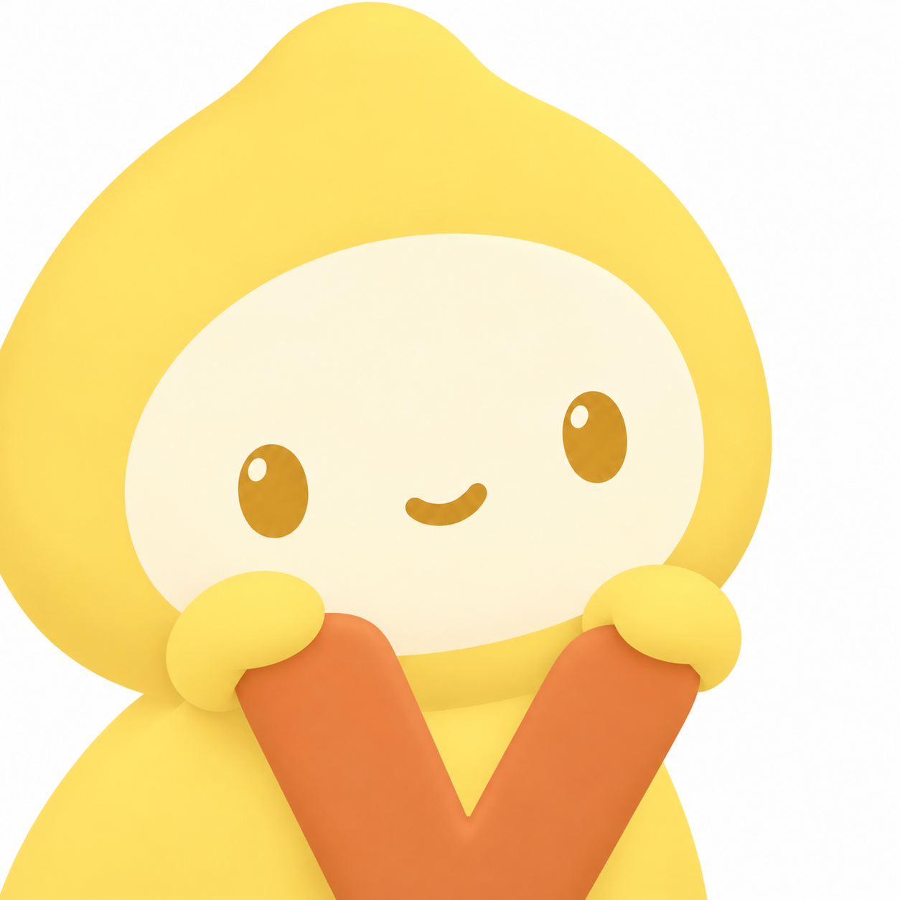

# B1 与 V · 白底橙字候选

以 B1 原图为角色参照，保留大脸、柚子头套、金色眼睛和小手。背景白色，V 焦橙色，黄色头套与奶油色脸蛋保持。以饱满、少留白优先，允许偏心及边缘裁切。

| 编号 | 结合方式 | 构图意图 |
|---|---|---|
| E1 | 双手捧着 V | V 较小，放在下巴与胸前，突出原角色 |
| E2 | 趴在 V 上 | V 位于前景下方，小手搭在笔画上 |
| E3 | V 融入头套 | 保留原姿态，将橙色 V 放在头套额头 |
| E4 | 贴脸抱着 V | 大脸偏左，V 紧靠右下脸颊和胸前 |

E3/E4 使用 OpenAI 内置 image_gen，以 B1 为图片参考，分别生成，原图尺寸 1254 × 1254。提示词：[E34-white-prompts.json](E34-white-prompts.json)；来源：[E34-white-results.json](E34-white-results.json)。

E1/E2 同样使用内置 image_gen，原生尺寸 1254 × 1254。精确提示词与生成记录：[E12-prompts.json](E12-prompts.json)。

## E1 · 双手捧着 V

## E2 · 趴在 V 上

## E3 · V 融入头套

## E4 · 贴脸抱着 V

