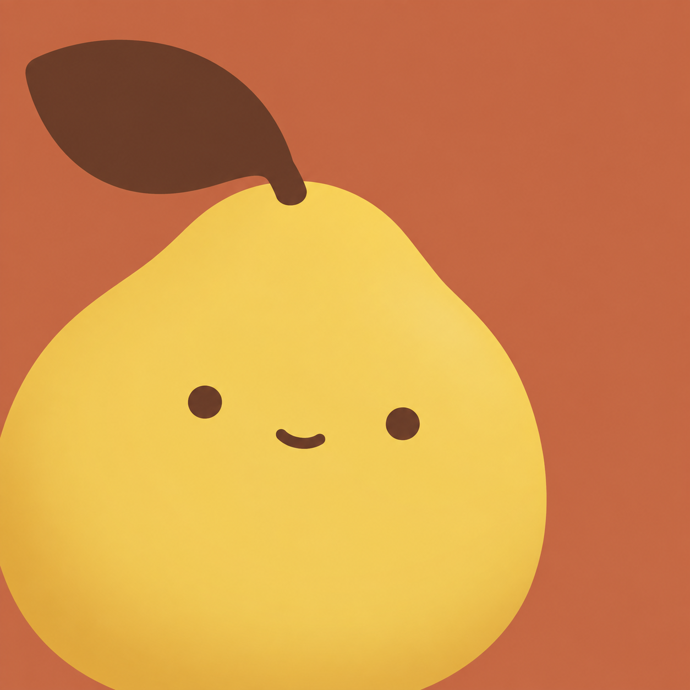
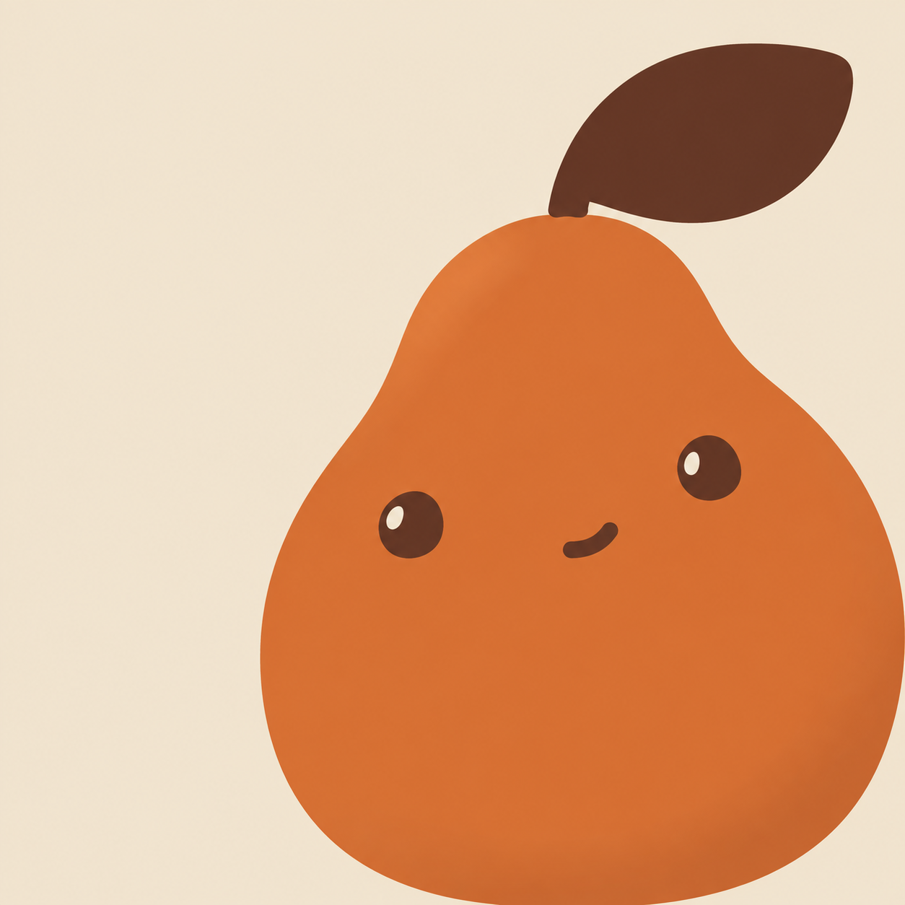
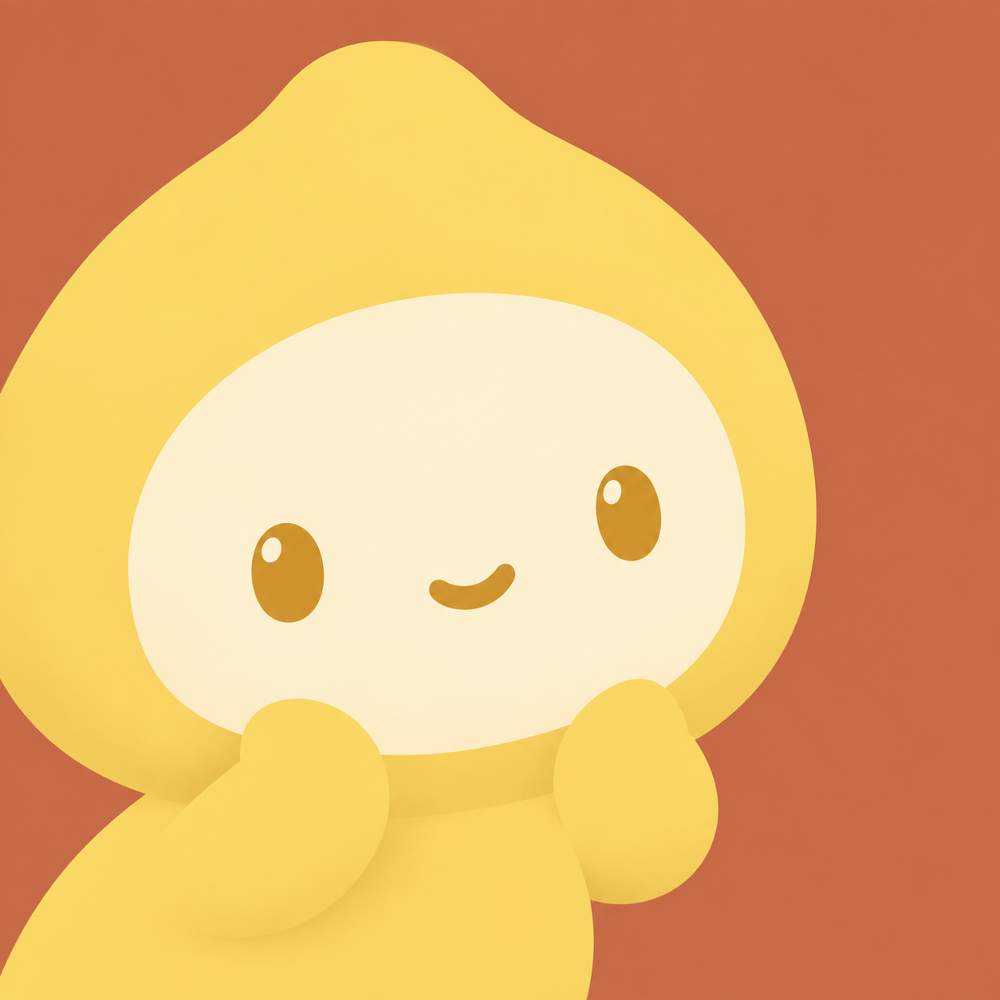
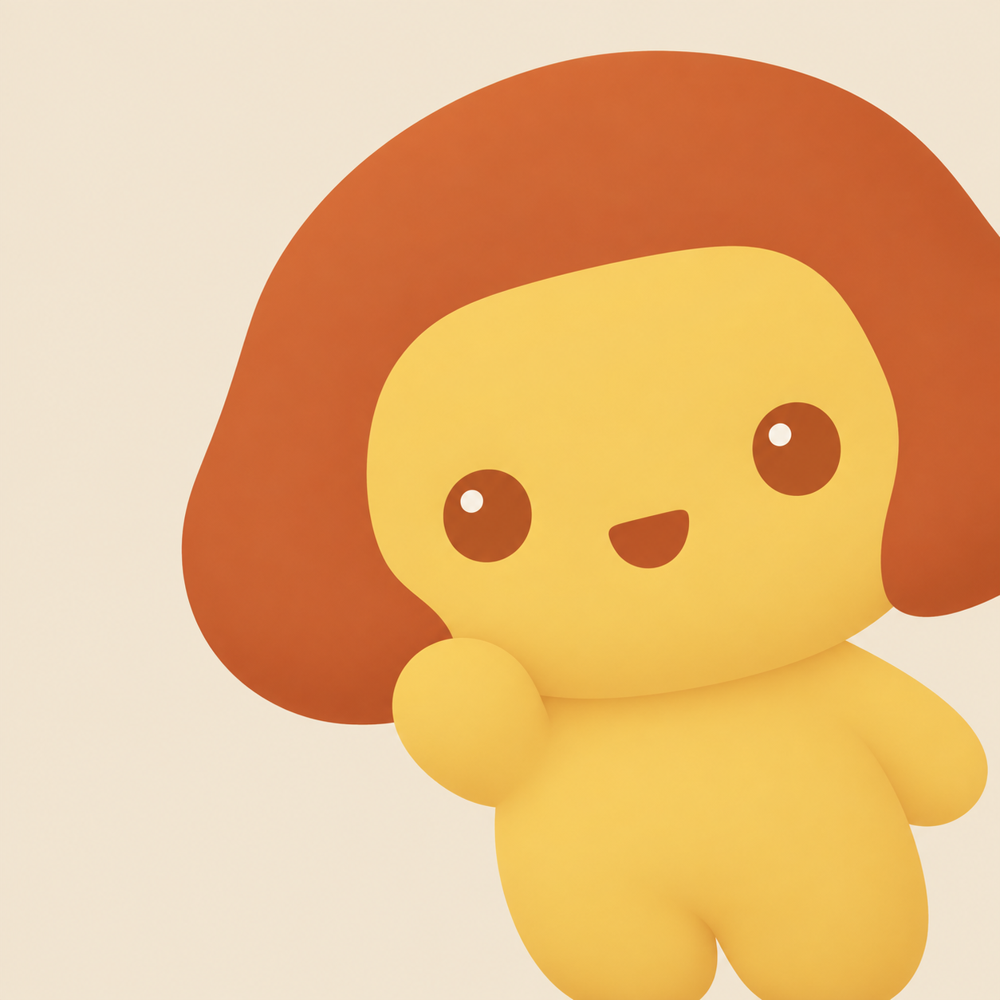
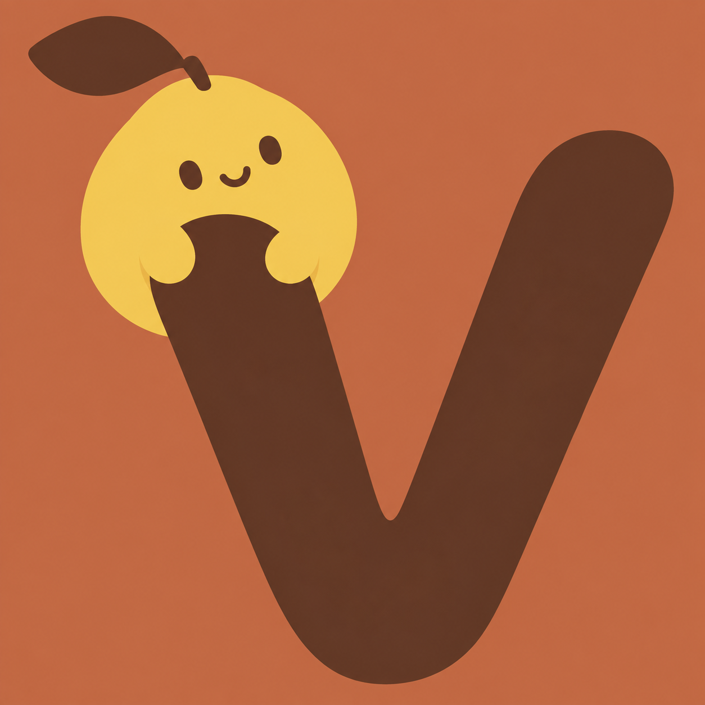
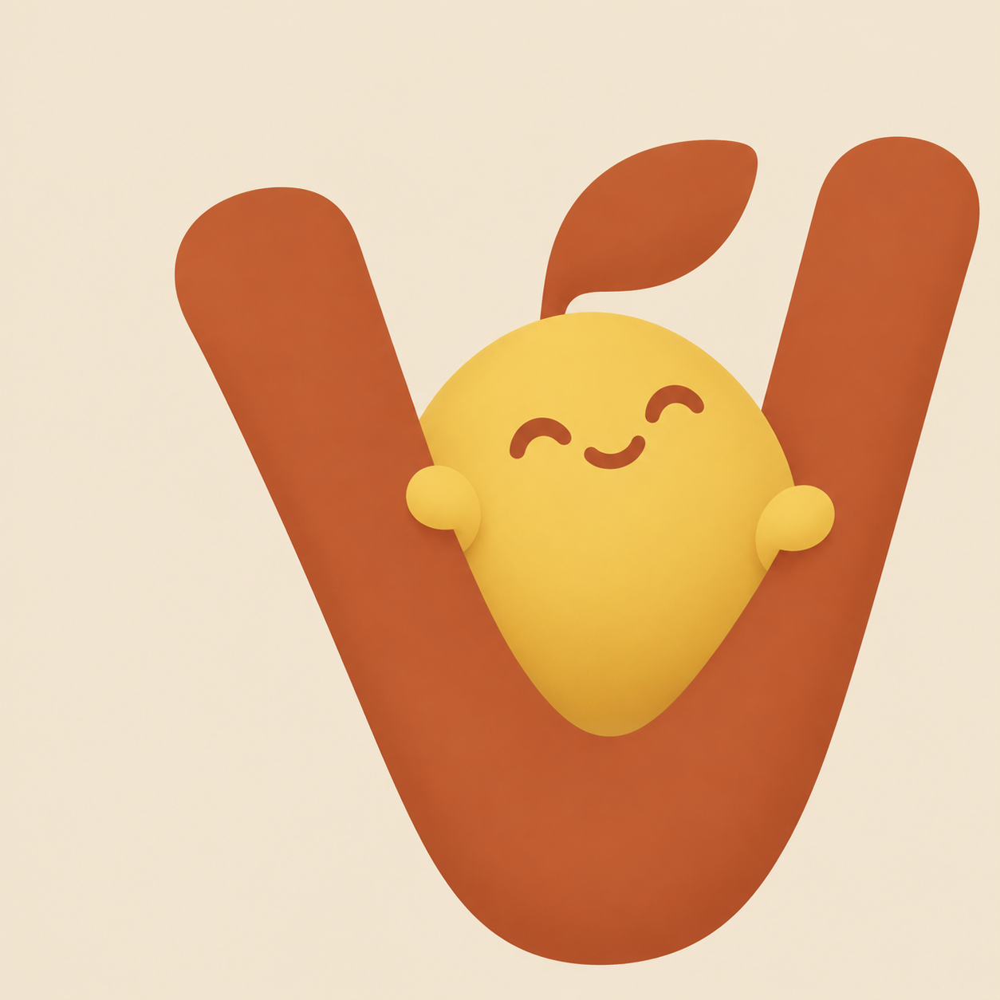

# YzVibe · 小柚子 Logo 候选

设计简报：面向大众的随身 Vibe 伙伴，强调随时随地继续创造、减少订阅额度来不及使用的焦虑；聪明、松弛、俏皮。角色灵感来自女儿“小柚子”，延续焦橙与暖纸色。

使用 OpenAI 内置 image_gen；工具未公开具体模型 ID。六张分别独立生成一次，原图保存，无重采样或修图。提示词请求 1536 × 1536，实际原生尺寸如下。左右下角为提示词中的构图分配。

| 编号 | 方向与原图 | 寓意 | 指定构图 | 尺寸 | 背景色 | 角色配色 |
|---|---|---|---|---|---|---|
| A1 | [柚柚随行 · 胖圆柚子](A1-pomelo-round-lower-left.png) | 随时陪你轻松 Vibe 的水果伙伴 | 左下 | 1254 × 1254 | `#C66B45` | `#F3CD58 / #603A27` |
| A2 | [柚柚随行 · 梨形柚子](A2-pomelo-pear-lower-right.png) | 轻松俏皮的随身水果伙伴 | 右下 | 1254 × 1254 | `#F2E6D2` | `#CB682F / #5C3627` |
| B1 | [小柚子女孩 · 柚子头套](B1-pomelo-hood-girl.png) | 呼应女儿小柚子的温暖陪伴 | 左下 | 1254 × 1254 | `#C66B45` | `#F4CE62 / #FFF0CB` |
| B2 | [小柚子女孩 · 柚皮发型](B2-pomelo-peel-hair-girl.png) | 将柚子与女孩融合成亲切角色 | 右下 | 1254 × 1254 | `#F2E6D2` | `#B9592F / #F0C65A` |
| C1 | [V 与小柚子 · 趴挂](C1-v-hanging-pomelo.png) | 用 V 连接 Vibe，表达轻松与自由 | 左下 | 1254 × 1254 | `#C66B45` | `#F3CD58 / #603A27` |
| C2 | [V 与小柚子 · 窝坐](C2-v-cradled-pomelo.png) | 像坐进吊床一样松弛地创造 | 右下 | 1254 × 1254 | `#F2E6D2` | `#F0C65A / #B9592F` |

完整提示词与配色：[A](A-prompts.json) · [B](B-prompts.json) · [C](C-prompts.json)。[C 原图来源与尺寸](C-results.json)。

约束通过主提示词传递。A/B 无文字；C 按用户要求包含且仅包含手写大写 V。配色值为生成意图，原图以模型返回结果为准。

## A1 · 柚柚随行 · 胖圆柚子

## A2 · 柚柚随行 · 梨形柚子

## B1 · 小柚子女孩 · 柚子头套

## B2 · 小柚子女孩 · 柚皮发型

## C1 · V 与小柚子 · 趴挂

## C2 · V 与小柚子 · 窝坐

