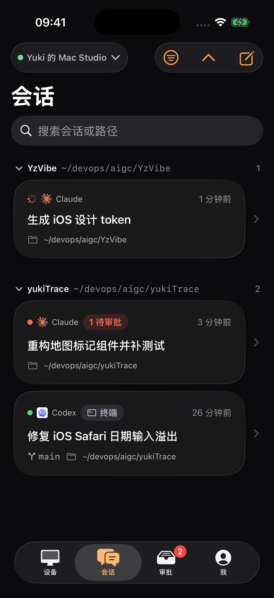
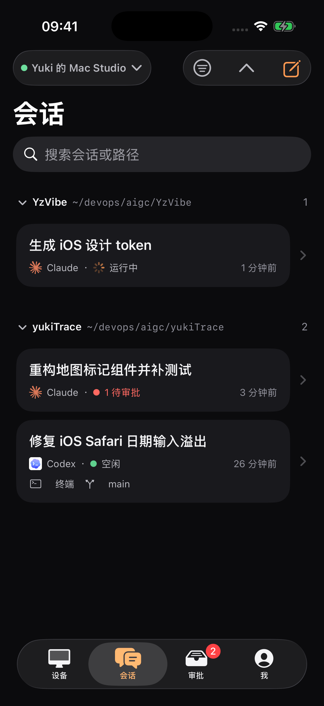
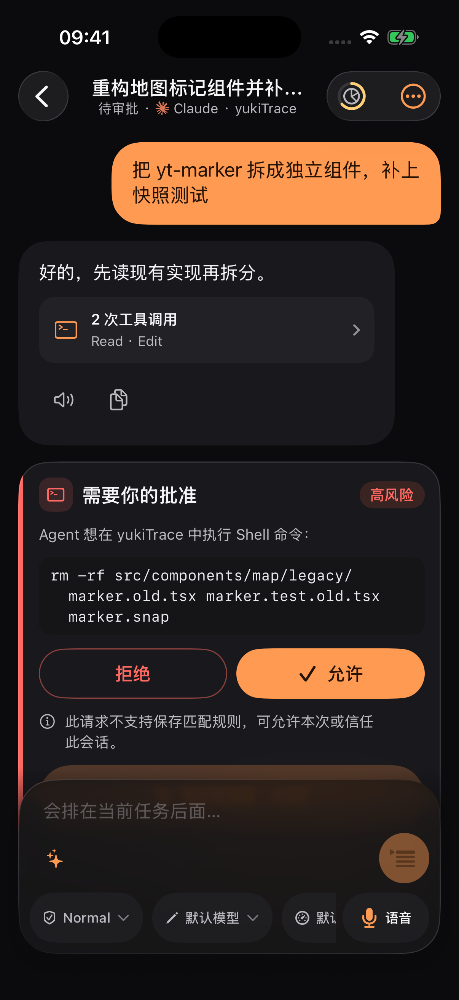
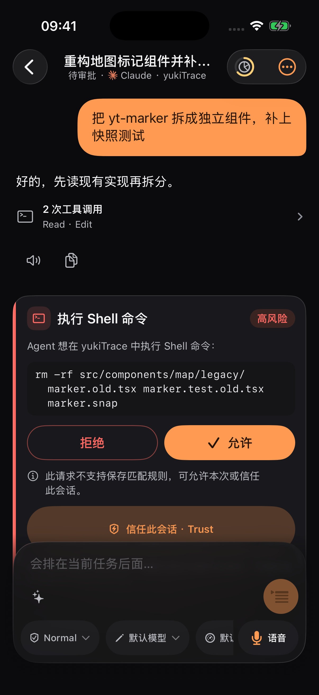

# iOS 视觉优化 · 2026-09-15

黑橙品牌保持一致，减少内容层装饰，让任务标题和回复正文更突出。

## 前后对比

截图来自同一 iPhone 17 Pro / iOS 26.5 模拟器的 Debug 演示数据，非设计稿。运行状态与滚动位置可能随截图时间变化。

| 会话 · 修改前 | 会话 · 修改后 |
| --- | --- |
|  |  |

| 聊天 · 修改前 | 聊天 · 修改后 |
| --- | --- |
|  |  |

## 变化

- 会话卡使用不透明内容面，标题前置，按目录分组时去除重复路径。
- 运行、空闲和待审批状态提供文字；来源与分支使用中性标签。
- 内容卡圆角统一为 20pt，导航和输入区继续使用系统玻璃。
- 助手正文直接排在页面上，扩大可用宽度；工具摘要去掉嵌套底色。
- 普通工具入口降低视觉强调；发送、主要决定和选中态保留橙色。
- 审批标题显示实际操作类别，审批逻辑不变。
- 大字号下，分组路径和会话元信息纵向排版；运行指示器的占位随字号缩放。
- 当前规范更新于 [DESIGN.md](../../../docs/DESIGN.md)，旧规范另存历史快照。

## 验证

- iOS Debug 模拟器构建通过。
- `PaletteContrastTests`：6 项通过。
- `ChatActivityTests` + `ApprovalActionTests`：10 项通过。
- `git diff --check` 通过。
- 已查看会话与聊天深浅色截图，以及会话最大辅助功能字号、聊天 accessibility-medium 字号的可见区域。
- Mac 当时锁定，未进行手动点按、搜索、侧滑或完整滚动检查；未做真机验收。截图只证明所示静态区域的布局。

### 其他外观

- [浅色会话](sessions-light.png)
- [浅色聊天](chat-light.png)
- [最大辅助功能字号会话](sessions-largest.png)
- [较大字号聊天](chat-large.png)
