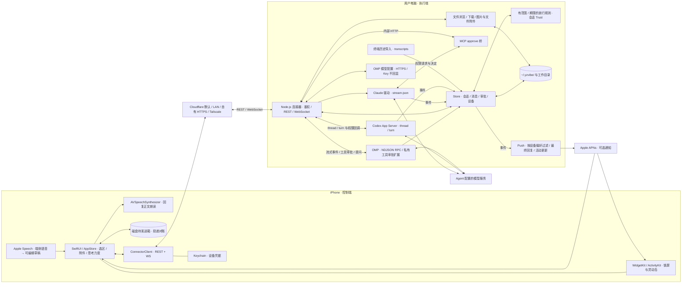
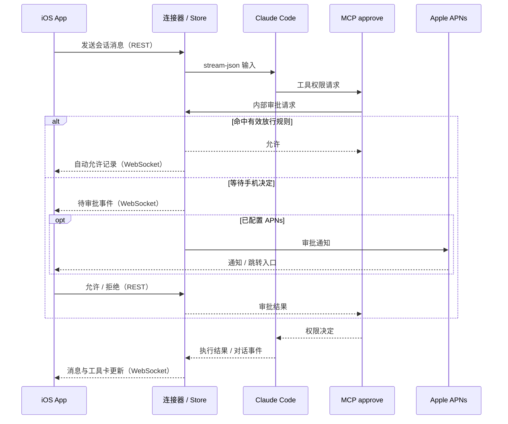

# 柚子Vibe 架构

柚子Vibe 将手机交互与桌面执行分开：iOS 是控制端，Node.js 连接器是会话与事件中心，Claude Code / Codex / OMP 子进程负责实际编程任务。本文依据 iOS 0.1.0 (28) / Connector 0.1.3 的仓库实现描述（2026-09-14；build 28 已上传，Apple 后续处理待核验）。

## 可编辑总览

下面的 Mermaid 与 SVG 总览表达相同的组件关系；修改架构时应同步更新两者。

## 组件与源码

| 层         | 主要职责                           | 入口                                                                                                                |
| --------- | ------------------------------ | ----------------------------------------------------------------------------------------------------------------- |
| iOS 展示与状态 | 设备、会话、聊天、审批、文件；事件合并与前台恢复       | [AppStore.swift](../ios/Sources/YzVibeKit/Store/AppStore.swift)、[Features](../ios/Sources/YzVibeKit/Features)     |
| iOS 语音 | Apple 端侧识别、草稿恢复、原生朗读及音频会话互斥 | [Voice](../ios/Sources/YzVibeKit/Voice) |
| iOS 投递与恢复 | 磁盘待发送箱、接收对账、按轮次交付记录、地址身份验证 | [AppStoreDelivery.swift](../ios/Sources/YzVibeKit/Store/AppStoreDelivery.swift)、[AppStoreConnections.swift](../ios/Sources/YzVibeKit/Store/AppStoreConnections.swift) |
| iOS 通信    | REST、WebSocket、配对和 Keychain 凭据 | [ConnectorClient.swift](../ios/Sources/YzVibeKit/Networking/ConnectorClient.swift)                                |
| 连接器入口     | 进程管理、访问方式、配对展示                 | [CLI](../connector/bin/yzvibe.js)、[daemon.js](../connector/src/daemon.js)、[tunnel.js](../connector/src/tunnel.js) |
| API 与事件   | 路由、设备鉴权、Agent 调度、WS 广播         | [server.js](../connector/src/server.js)                                                                           |
| 状态与持久化    | 会话、消息、审批、设备和规则                 | [store.js](../connector/src/store.js)、[rules.js](../connector/src/rules.js)                                       |
| Agent 适配  | CLI 子进程生命周期与事件翻译               | [claude.js](../connector/src/agents/claude.js)、[codex-app-server.js](../connector/src/agents/codex-app-server.js)                       |
| 权限桥       | 将 Claude MCP 权限请求转成等待手机决定的请求   | [mcp-approve.js](../connector/src/mcp-approve.js)                                                                 |
| 文件与历史     | 文件边界、图片上传、终端历史扫描与翻译            | [files.js](../connector/src/files.js)、[transcripts.js](../connector/src/transcripts.js)                           |
| 通知与维护     | APNs、空闲进程回收、过期资源清理             | [push.js](../connector/src/push.js)、[cleanup.js](../connector/src/cleanup.js)                                     |

## 一次 Claude 审批的往返

Codex 生产驱动通过 App Server 的 thread / turn RPC 续聊并处理手机审批。Normal 使用工作目录可写沙箱和 on-request 审批，Plan 使用只读沙箱。旧 exec 驱动保留在源码中，不是当前服务端入口。Mock 驱动用于不依赖模型服务的开发演示。

## 状态、恢复与边界

- **控制与事件**：REST 处理操作和状态查询，WebSocket 推送事件；App 恢复前台后重连并同步消息。APNs 提供通知入口，完整内容仍通过连接器读取。
- **会话生命周期**：Claude 多轮复用进程，空闲回收后使用会话 ID 恢复；Codex 通过 App Server 管理 thread 与 turn。连接器能发现并导入本机终端历史。
- **数据位置**：连接器状态保存在 `~/.yzvibe/`，工作文件保留在项目目录；客户端凭据进入 Keychain。连接器数据目录可通过 `YZVIBE_HOME` 指定。
- **网络边界**：局域网使用 HTTP / WS；HTTPS 隧道在外部入口提供 TLS。Tailscale 是另一种网络可达方式，不是独立的柚子Vibe服务。模型服务与 Apple APNs 均位于用户电脑之外。
- **通知内容**：审批与回复开关保存在设备通知偏好中，连接器按设备过滤。回复通知仅由最终完成事件触发，避免工具中间轮次重复推送。APNs 可包含审批或回复摘要，不能将“本地优先”理解成没有外部数据传输。
- **访问控制**：一次性配对码用于签发设备 Token；撤销设备会使其凭据失效。具体接口、鉴权方式和数据模型见 [共享协议](../shared/protocol.md)。

Live Activity 已通过 WidgetKit 扩展和 `SessionActivity.swift` 接入，连接器接收活动 Token 后通过 APNs 更新状态。消息队列、Git 改动视图、命令 / Skill 面板和候选地址切换也已加入主链路。Android 与小程序仍为规划。

本图展示组件关系，不表示所有异常路径均已验证。当前检查发现的问题见 [优化与拓展检查报告](REVIEW.md)。

## 可靠投递与交付记录

Connector 0.1.1 新增 `requests.js` 接收限额与字段验证、`diagnostics.js` 脱敏诊断；Store 将投递接收记录和队列原子保存，并用追加日志恢复流式文本。iOS `AppStoreDelivery.swift` 管理磁盘待发送箱、接收对账和交付记录，WS 快照与增量共用有序通道。详见 [协议补充](../shared/protocol.md#connector-011可靠投递恢复与诊断) 和 [build 11](RELEASE-0.1.0-11.md)。

iOS build 12 的 `AppStoreConnections.swift` 在目标地址身份与 Token 验证成功后提交切换；HTTP 地址版本避免旧故障转移覆盖新选择。`TaskRun` 读取已有消息关联，交付卡放回其所属轮次。详见 [build 12](RELEASE-0.1.0-12.md)。

## 端侧语音与输入链路

`VoiceInputController` 管理按住录音、上滑取消、草稿合并与中断恢复；`AppleSpeechRecognitionProvider` 通过 `AVAudioEngine` 采集音频，显式设置 `requiresOnDeviceRecognition = true`，并检查设备与语言的端侧识别可用性。不可用时返回提示，不回退云端识别。**音频不发送给连接器**：识别结果进入可编辑草稿，用户发送后才沿普通文本投递链路传给 Agent。

`ReplySpeechText` 过滤代码块、常见命令和日志；`ReplySpeaker` 使用 `AVSpeechSynthesizer` 朗读回复正文，支持停止、切换回复和音频中断处理。录音与朗读互斥。聊天正文通过原生文本视图支持选区与连续正文跨段落复制，图片、表格和代码块仍独立渲染。

星光菜单统一照片、相机、系统文件选择、命令行与技能入口；附件保持原始字节与文件名，随草稿、待发送箱和消息持久化，每条最多 6 个、总计 20 MB。思考力度滑条在拖动时本地预览，松手后保存选项。

## 审批、通知与连接恢复的更新

- Claude MCP、Codex App Server 与 OMP 私有工具扩展均接入手机审批。规则可按工具 / 命令设定会话或全局范围及期限；会话 Trust 与规则放行是不同范围的操作，Codex Trust 会同时跳过审批和沙箱。
- 执行记录按需加载，避免把完整工具输出放入每次会话同步；交付卡依据轮次关联定位。
- 客户端区分重连、隧道地址不可用与配对凭据失效，提供重试、Bonjour 局域网找回及更新地址入口。候选地址必须完成连接器身份和设备 Token 验证后才提交切换。
- `html/` 是静态介绍页，由独立 nginx 服务提供；它不参与 App 配对、Agent 执行、语音处理或消息存储。

## OMP 与文件预览

OMP 通过独立 NDJSON RPC 子进程接入，不复用 Codex App Server。驱动支持分片重组、原生历史活动分支导入、原生 ID 恢复、提问和工具审批；复用连接器的投递回执、队列、交付记录与推送。Normal 放行本地读取，其他工具审批；Plan 拒绝写入、Shell 与网络/扩展工具；Trust 跳过工具审批。审批桥或扩展握手失败时拒绝执行。工具拦截不是操作系统沙箱，也不提供跨终端写入锁。

`omp-config.js` 只读取明确配置的模型；iOS 配置页仅通过 HTTPS 提交已配对设备的更新，GET 不回显 Key，服务端以独立私有文件和 `!cat` 引用保存。修订版本校验防止覆盖并发修改。运行中的任务不被打断，下一轮重建 OMP 子进程并恢复原会话。详细边界见 [OMP 接入](OMP.md)。

`RemoteFileReference` 将回复中的本地文件引用转换为带独立路径参数的 App 内链接；`FileViewerView` 处理 Markdown 渲染、相对链接、图片及视频播放。文件经连接器鉴权读取，中文及特殊字符正确编码。Markdown/代码预览限制为 2 MB，视频下载到临时文件后播放。路径校验、符号链接检查与敏感凭据拦截仍生效。详见 [文件预览](REMOTE-FILE-PREVIEW.md)。
