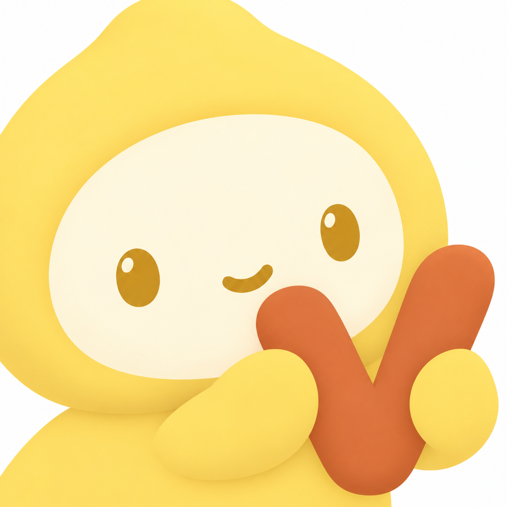

# YzVibe 品牌与 App 图标

## 已选方向：E4 · 小柚子抱 V

白色背景上的小柚子女孩，戴黄色柚子头套、露出奶油色大脸，双手抱着橙色手写大写 V。角色源于“小柚子”的家庭故事，表达聪明、松弛、俏皮的随身伙伴，呼应“随时随地继续 Vibe”。画面采用饱满近景，保留用户选中的 E4 构图。

生成目标色为白色 `#FFFFFF`、焦橙 V `#C66B45`，以及原 B1 的柚黄与奶油色。位图包含自然色阶，界面控件色仍以 [Theme.swift](../ios/Sources/YzVibeKit/Design/Theme.swift) 为准。

## 当前资源

| 资源 | 路径 | 用途 |
| --- | --- | --- |
| 已选 E4 | [E4-white-bg-orange-v.png](../design/logo-ip-candidates/E4-white-bg-orange-v.png) | 1254 × 1254 原始候选 |
| 品牌原图 | [yzvibe-logo-original.png](../design/brand/yzvibe-logo-original.png) | 与 E4 相同的原图 |
| 标准 Logo | [yzvibe-logo.png](assets/yzvibe-logo.png) | 1024 × 1024 无透明通道 PNG，README 与品牌展示 |
| iOS AppIcon | [AppIcon.png](../ios/App/YzVibe/Assets.xcassets/AppIcon.appiconset/AppIcon.png) | 与标准 Logo 相同，桌面、系统通知使用 |
| App / Widget 共用图 | [BrandLogo.png](../ios/Sources/YzVibeKit/Resources/BrandAssets.xcassets/BrandLogo.imageset/BrandLogo.png) | 256 × 256，App 内身份卡、灵动岛、锁屏实时活动 |
| 原始提示词 | [logo-prompt.txt](../design/brand/logo-prompt.txt) | E4 的完整生成提示词，以 B1 原图为参考 |

原图通过内置 image_gen 生成；接入时仅使用系统 sips 等比缩放，不重新生成、改色或改变构图。旧 Logo 保存在 [archive/v1](../design/brand/archive/v1/) 和 [archive/v2](../design/brand/archive/v2/)，仅供历史回溯，不用于当前产品。

## iOS 接入

- `AppIcon.appiconset` 提供 1024 正方形图标，未预先裁切外轮廓圆角，由 iOS 处理。
- `YzVibeKit` 通过 Swift Package 资源目录提供 `BrandLogo`，App 与 Widget 均通过 `Bundle.module` 加载同一资源，使用原色渲染。
- App“我”页身份卡、灵动岛展开 / 紧凑 / 最小形态、锁屏实时活动均展示 E4。运行进度、审批数量、状态文字继续显示。
- 通知横幅与通知中心的头部图标由系统使用应用图标显示，见 [Apple 通知外观文档](https://developer.apple.com/documentation/usernotificationsui/customizing-the-appearance-of-notifications)。无需为 APNs 载荷添加图标。
- 重新构建并安装新版 App 后生效；已经在显示的实时活动应结束后重新开启，以加载新版 Widget。
- 当前提供默认全彩图标，未单独制作深色、着色或分层 Icon Composer 版本。

在 `ios/` 执行 `xcodegen generate` 后打开工程构建。所有展示保持正方形比例，不拉伸图像。
